# DIAGNOSTIC — salles-api, le repo malade

Relevés du 7 octobre 2026. Branche de réparation : `reparation-harness`.

## Ce qu'il faut savoir avant de lire

**Le TP a été fait avec Claude Code, pas avec OpenCode.** OpenCode n'a jamais été lancé et
aucun de ses résultats n'est simulé ici. Conséquences :

- Tout ce qui est outillage du dépôt (scripts npm, lint, types, tests, hooks Git, CI, MCP,
  API) a été **exécuté** ; chaque ligne du tableau cite la commande et sa capture.
- La chaîne d'agents `.opencode/` (subagents, droits, command, plugin) a été **lue et
  corrigée, pas exécutée**. Ces lignes sont marquées *lu*. Les corrections de `.opencode/`
  n'ont pas été testées sous OpenCode.
- L'exercice 1 a été joué dans Claude Code, qui ne voit ni `AGENTS.md` ni `.opencode/` sur
  le dépôt d'origine : il montre ce que valent les filets, pas le comportement de
  l'orchestrateur `architect`.

Les captures sont de vraies captures de fenêtres console. Elles montrent le script
[`preuves/scripts/preuve.sh`](preuves/scripts/preuve.sh) rejoué sur un clone du dépôt
d'origine (`avant-*`) puis sur un clone du dépôt réparé (`apres-*`). Les captures de
l'exercice 1 affichent le résumé des transcriptions enregistrées dans
[`preuves/ex1/`](preuves/ex1/), pas l'interface interactive.

**Reste à faire :** pousser. `origin` est le dépôt de l'enseignant ; il faut un dépôt à
toi pour y pousser la branche.

## Exercice 1 — la tâche, avant

Tâche lancée telle quelle, session neuve, sur un clone intact :
[transcription](preuves/ex1/avant.resume.txt), [diff produit](preuves/ex1/avant.diff).

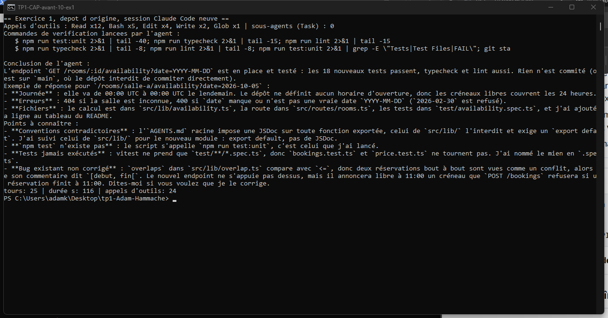

Ce qu'on observe :

- **Personne d'autre ne travaille.** Un seul agent, aucun sous-agent, aucune relecture
  indépendante, aucun test de l'application lancée.
- **Il suit une règle fausse.** `src/lib/AGENTS.md` exige un `export default` et interdit
  la JSDoc ; l'agent s'y conforme, alors qu'aucun module existant ne le fait.
- **Tout est vert, et ça ne prouve rien.** Il lance `test:unit`, `typecheck` et `lint` :
  verts. Le lint n'a aucune règle, les types ne sont pas stricts, et les deux fichiers de
  tests qui échoueraient ne sont pas exécutés.
- **Un bug de facturation reste invisible.** Le prix du week-end vaut `"5020"` au lieu de
  `70` ; rien ne le signale, l'agent ne le voit pas.
- **Le résultat est incohérent avec l'existant.** Le nouvel endpoint annonce libre à 11:00
  un créneau que `POST /bookings` refuse (bug de chevauchement). L'agent le remarque et le
  laisse.

## Les problèmes

*exécuté* = commande lancée, capture à l'appui. *lu* = constaté dans le fichier.

### Rules

| # | Symptôme | Cause | Réparation |
|---|---|---|---|
| 1 | `npm test` → `Missing script: "test"` ; `npm run build` → idem. La règle « à lancer avant tout commit » est inapplicable. *exécuté* | `AGENTS.md`, `package.json` | Script `test` ajouté, plus `check` (types + lint + tests). `build` retiré de la doc : `tsx` exécute le TypeScript, rien n'est compilé. |
| 2 | « Les erreurs remontent en `Result`, jamais en `throw` » : `grep` ne trouve aucun `Result` ; `validate.ts` lève `ValidationError`, `bookings.ts` l'attrape. *exécuté* | `AGENTS.md` conv. 2 | Règle réécrite pour décrire ce que fait le code. |
| 3 | « Un `export default` par module, obligatoire » : 0 `export default` dans `src/lib/*.ts`. L'agent de l'exercice 1 a suivi la règle et produit un module différent des trois autres. *exécuté* | `src/lib/AGENTS.md` | Règle remplacée par « exports nommés ». Les « scripts de facturation » qui la justifiaient n'existent pas dans le dépôt. |
| 4 | Claude Code ne lit pas `AGENTS.md`. *comportement documenté de Claude Code, non mesuré* | absence de `CLAUDE.md` | `CLAUDE.md` qui importe `@AGENTS.md`. |

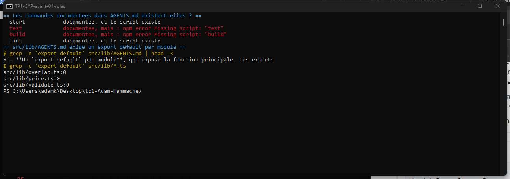
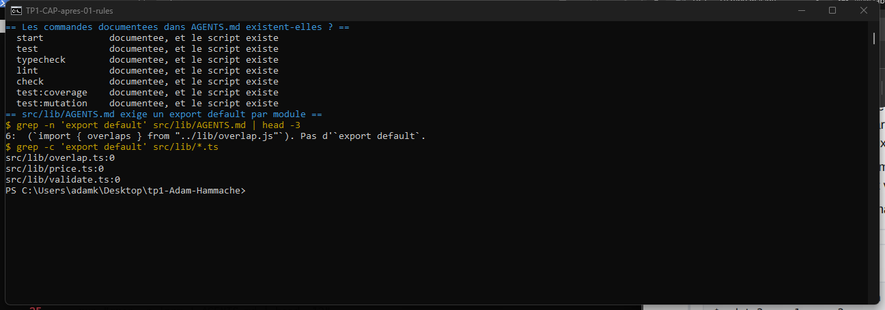

### MCP

Six serveurs déclarés, tous `enabled: true`. Aucun ne sert. Treize problèmes distincts ;
la réparation est la même pour tous : **les six sont retirés** de `opencode.json`
(`salles-db` reviendra avec la vraie base, INFRA-140).

| # | Serveur | Symptôme | Preuve |
|---|---|---|---|
| 5a | `salles-db` | Injoignable : `ENOTFOUND mcp.internal.salles.lan`. | *exécuté* |
| 5b | `salles-db` | Jeton écrit `${SALLES_MCP_TOKEN}` : OpenCode attend `{env:NOM}`, la chaîne partirait telle quelle dans l'en-tête. | *lu* |
| 5c | `salles-db` | `SALLES_MCP_TOKEN` n'est défini nulle part : ni dans `.env`, ni dans la config. | *exécuté (`grep` → 0)* |
| 5d | `salles-db` | Il branche une base qui n'existe pas encore : le service stocke en mémoire, la base arrive avec INFRA-140. | *lu (`AGENTS.md`)* |
| 5e | `github` | Paquet `@modelcontextprotocol/server-github` déprécié sur npm (« Package no longer supported »). | *exécuté (`npm view`)* |
| 5f | `github` | Aucun jeton fourni (pas de bloc `environment`) : le serveur démarre, publie 26 outils, et un vrai appel répond `Authentication Failed: Requires authentication`. | *exécuté* |
| 5g | `slack` | Paquet déprécié lui aussi, et le processus sort en erreur au démarrage : `Please set SLACK_BOT_TOKEN and SLACK_TEAM_ID`. | *exécuté* |
| 5h | `notion` | Démarre, publie 24 outils, et chaque appel répond 401 `unauthorized`. C'est le plus coûteux : ≈ 19 000 tokens de définitions à lui seul. | *exécuté* |
| 5i | `sentry` | HTTP 401 : l'authentification n'a jamais été faite. Le projet n'embarque d'ailleurs aucun SDK Sentry (`grep -ci sentry package.json` → 0). | *exécuté* |
| 5j | `playwright` | Un pilote de navigateur (25 outils) pour une API JSON sans interface. | *exécuté (outils listés)* |
| 5k | tous les locaux | `npx -y` sans version, et `@playwright/mcp@latest` : chaque démarrage télécharge et exécute la dernière version publiée, sans verrou. | *lu* |
| 5l | tous | **Personne ne s'en sert.** Zéro mention dans `AGENTS.md`, le README, les sept prompts d'agents et la command. Et les sept agents ont `"*": deny` sans aucune règle nommant un outil MCP : aucun agent de la chaîne n'a le droit d'en appeler un. | *exécuté (`grep` → 0 et 0 / 7)* |
| 5m | `github`, `notion`, `playwright` | **75 outils, ≈ 28 000 tokens de définitions**, dont 33 qui écrivent ou agissent à l'extérieur (`push_files`, `create_repository`, `API-delete-a-block`, `browser_evaluate`…) — dans un dépôt qui suivait un `.env` (n° 23). | *exécuté* |

Ce que je n'ai pas pu établir sans OpenCode : si ces définitions sont réellement envoyées
au modèle quand l'agent a `"*": deny`, ou si OpenCode les masque. Dans le premier cas elles
occupent 28 000 tokens pour rien ; dans le second elles sont chargées pour n'être jamais
visibles. Le chiffre mesuré est la taille de ce que les serveurs publient, pas le contexte
réellement consommé par `architect`.

Les six ont été ajoutés en deux commits (11 juin et 2 juillet 2026), après la chaîne
d'agents, sans qu'aucun prompt ne soit modifié pour les utiliser.

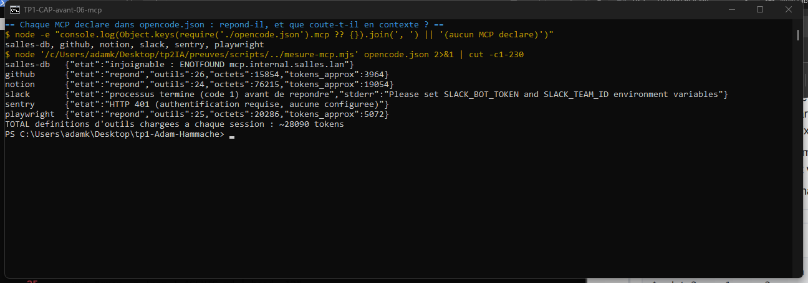
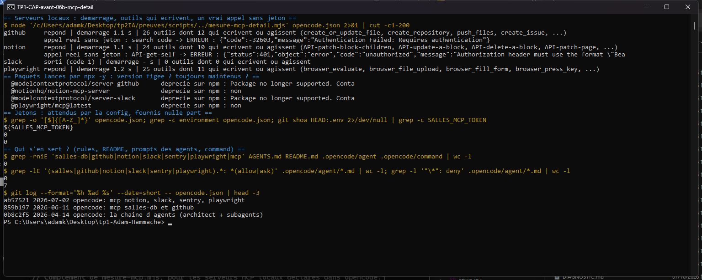
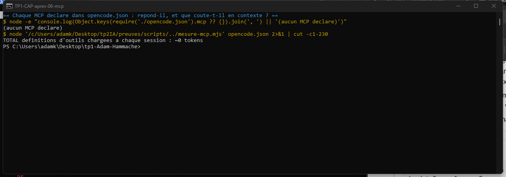

### Skills et commands

| # | Symptôme | Cause | Réparation |
|---|---|---|---|
| 7 | `/ship` fait `git add -A`, commit, push « sans poser de question », interdit de relancer les checks (« le hook s'en est déjà occupé ») et de demander une relecture. Or le hook ne bloque rien (n° 14), `git add -A` embarque `.env`, et rien n'empêche de livrer sur `main`, ce que `AGENTS.md` interdit. *lu* | `.opencode/command/ship.md` | Réécrite : refuse `main`, relance `npm run check`, demande le verdict de `reviewer`, ajoute les fichiers un par un, confirmation avant commit et push. |

Aucun skill n'existait. Ce n'est pas un défaut : le dépôt n'a pas de savoir-faire répété à
empaqueter. Le skill `audit-harness` ajouté dans `.claude/skills/` est une demande du TP,
pas une réparation.

### Subagents et droits

Tout ce bloc est *lu* ; la capture montre les frontmatters avant et après.

| # | Symptôme attendu | Cause | Réparation |
|---|---|---|---|
| 8 | `finder` ne peut rien lire : son `"*": deny` est la **dernière** règle, et dans OpenCode la dernière règle qui correspond l'emporte. C'est l'agent qui « répond sans avoir rien lu ». | `.opencode/agent/finder.md` | Joker remonté en première ligne, comme chez les six autres. |
| 9 | `planner` est en `mode: primary` : l'orchestrateur ne peut pas l'appeler comme subagent. L'étape « Plan » de la boucle n'a jamais lieu. | `planner.md` | `mode: subagent`. |
| 10 | `tester` n'apparaît pas dans la table d'équipe de l'orchestrateur : il ne travaille jamais. | `architect.md` | Ligne ajoutée, et `tester` intégré à l'étape « Verify ». |
| 11 | `architect` « never writes code » mais a `edit: allow` et `bash: "*": allow` (commit « unblock, trop de refus de permission »). Son prompt dit qu'une question qu'un subagent peut traiter, « it can also be answered by you », et de tout faire lui-même en deçà de trois appels. Il n'a plus de raison de déléguer. | `architect.md` | `edit: deny`, `bash` limité à la lecture Git et aux checks (`ask` pour add/commit/push). Les deux phrases rétablies : ce qu'un subagent peut traiter doit l'être par lui. |
| 12 | `reviewer` : « fixes what it finds », `edit: allow`. Il relit donc son propre code ; son prompt dit pourtant que son indépendance est sa seule valeur. | `reviewer.md` | `edit: deny`, règle « never fix anything », description réalignée. |
| 13 | `dev` a `task: allow` et la consigne de découper le travail vers d'autres `dev` — alors que l'orchestrateur interdit deux `dev` sur les mêmes fichiers. Il peut aussi commiter, ce que son prompt lui interdit. | `dev.md` | `task: deny`, `git commit*: deny`, consigne remplacée par « arrête-toi et rapporte », format de retour imposé. |
| 13b | `explorer`, agent de lecture, a `edit: allow` sur tout le dépôt, `curl*: allow` et la consigne d'interroger « an internal service » — dans un dépôt qui contenait des secrets (n° 23). | `explorer.md` | Écriture limitée à `.opencode/plans/*-notes.md`, `curl` retiré, `webfetch: ask`. |
| 13c | `finder` : description et prompt lui demandent d'expliquer le design « en prose, généreusement », ce qui est le rôle d'`explorer` et contredit ses propres règles (« never read a whole file »). | `finder.md` | Rôle recentré : une liste `fichier:ligne`, rien d'autre. |

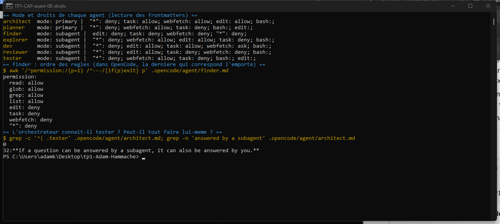
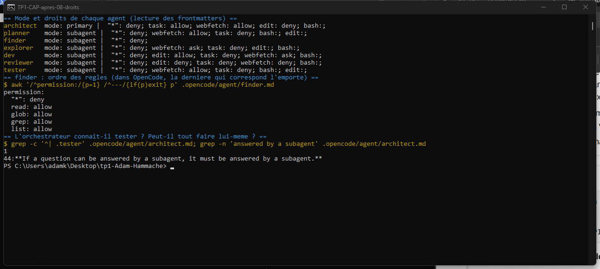

### Hooks

| # | Symptôme | Cause | Réparation |
|---|---|---|---|
| 14 | Le pre-commit n'est pas branché : `core.hooksPath` vide, `husky` absent des dépendances, pas de script `prepare`, fichier non exécutable (`100644`), et il source un `husky.sh` qui n'existe pas. Un commit d'un fichier fautif **passe**. *exécuté* | `.husky/pre-commit`, `package.json` | `husky` installé, `prepare: husky`, hook réécrit et rendu exécutable. Le même commit est maintenant **refusé**. |
| 15 | `scripts/checks.sh` renvoie `0` quoi qu'il arrive, et son en-tête dit qu'il est branché dans `opencode.json`, où il n'y a aucun hook. *exécuté* | `scripts/checks.sh` | Le script renvoie son vrai code et dit « CHECKS ROUGES ». L'intention d'INFRA-231 (ne pas interrompre l'agent) est conservée dans le plugin, qui lit la sortie sans lever d'erreur. En-tête corrigé. |
| 16 | Aucun hook côté Claude Code. | — | `.claude/settings.json` + `scripts/claude-post-edit.sh` : après l'écriture d'un `.ts`, les checks tournent et le rouge revient à l'agent. *exécuté dans une vraie session* |

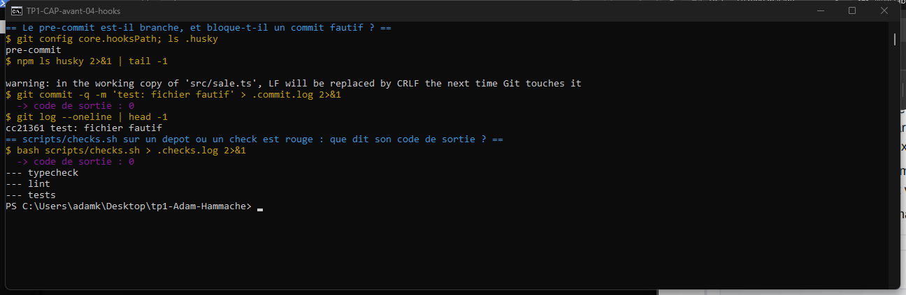
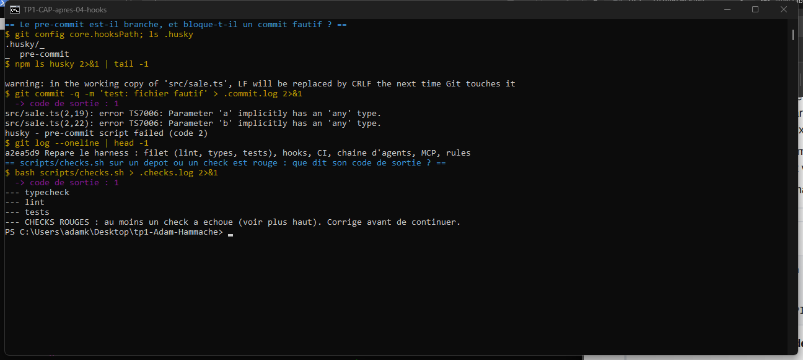
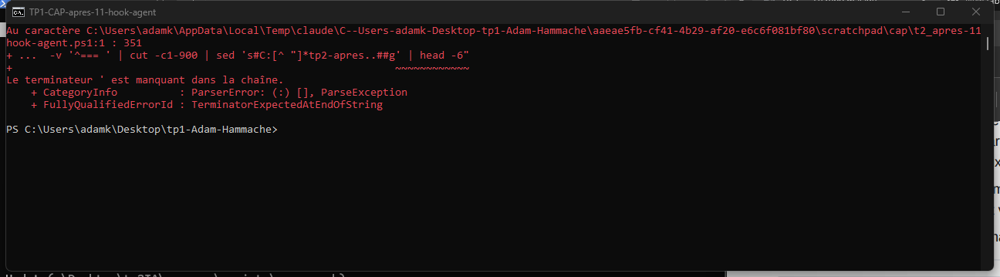

### Lint et types

| # | Symptôme | Cause | Réparation |
|---|---|---|---|
| 17 | Un fichier avec `var`, `==`, `debugger`, `any`, `eval`, variable inutilisée et paramètres non typés : `eslint` → code 0, `tsc` → code 0. *exécuté* | `eslint.config.js` (`rules: {}`), `tsconfig.json` (`strict: false`) | Règles recommandées d'ESLint et de typescript-eslint, `eqeqeq`, `no-var` ; `strict: true`. Le même fichier : 6 erreurs de lint, 2 de types. |
| 18 | `// @ts-nocheck` en tête de `price.ts` masque une addition nombre + chaîne. *exécuté (n° 20)* | `src/lib/price.ts` | Directive retirée. |

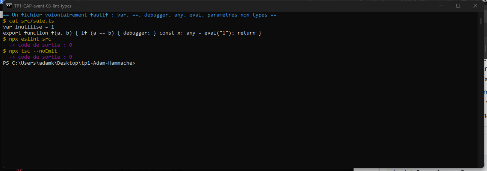
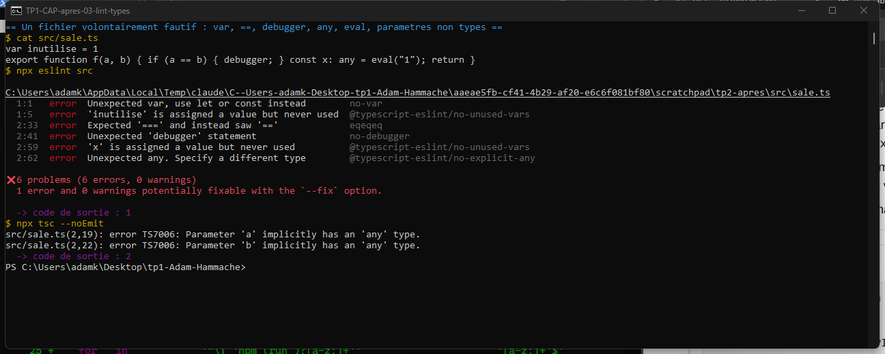

### Tests

| # | Symptôme | Cause | Réparation |
|---|---|---|---|
| 19 | 18 tests écrits, **5 exécutés**, 4 ignorés. `bookings.test.ts` et `price.test.ts` ne tournent jamais : le lanceur ne prend que `*.spec.ts`. *exécuté* | `vitest.config.ts` + nom des fichiers | Fichiers renommés en `.spec.ts`. La convention INFRA-205 est gardée et écrite dans `AGENTS.md`. |
| 20 | Lancés sans le filtre, 2 tests échouent et désignent deux bugs de production (ci-dessous). *exécuté* | — | Bugs corrigés. |
| 21a | `store.spec.ts` : deux tests sur trois vérifient un double défini dans le test, pas le store. *lu ; à la mutation, 1 mutant tué sur 40 dans `store.ts`* | `test/store.spec.ts` | Tests réécrits sur les vraies fonctions (sans modifier `src/store.ts`). |
| 21b | `overlap.spec.ts` : deux `skip` contiennent `expect(true).toBe(true)`, un troisième ignore justement le cas « bout à bout » qui échoue. *lu* | `test/overlap.spec.ts` | Trois vrais tests. |
| 21c | Couverture 21 %, score de mutation **4,35 %**. Routes, validation et tarification : 0 %. *exécuté* | — | Tests ajoutés (validation, routes, annulation, conflit) : 59 tests, couverture 98,8 %, mutation **97,52 %**. Seuils de couverture dans `vitest.config.ts`. |

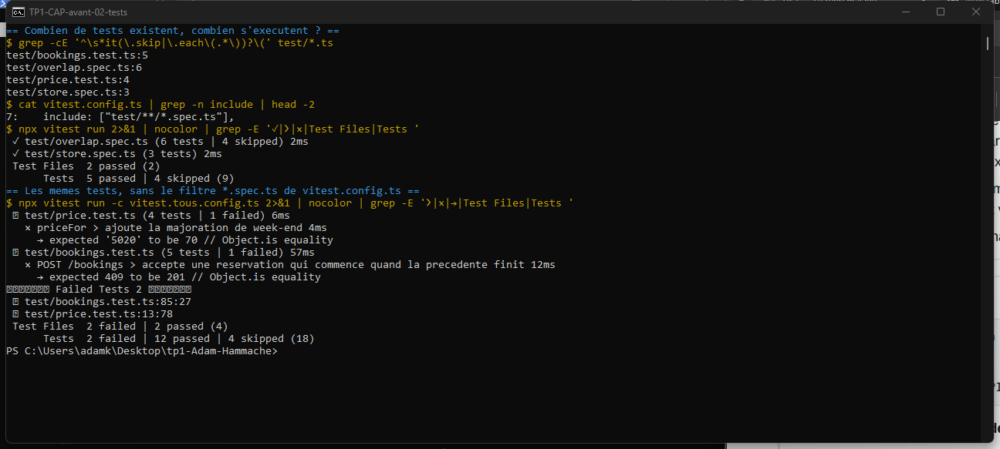
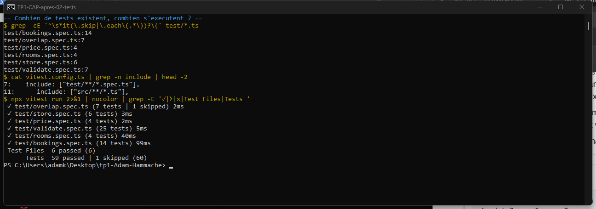
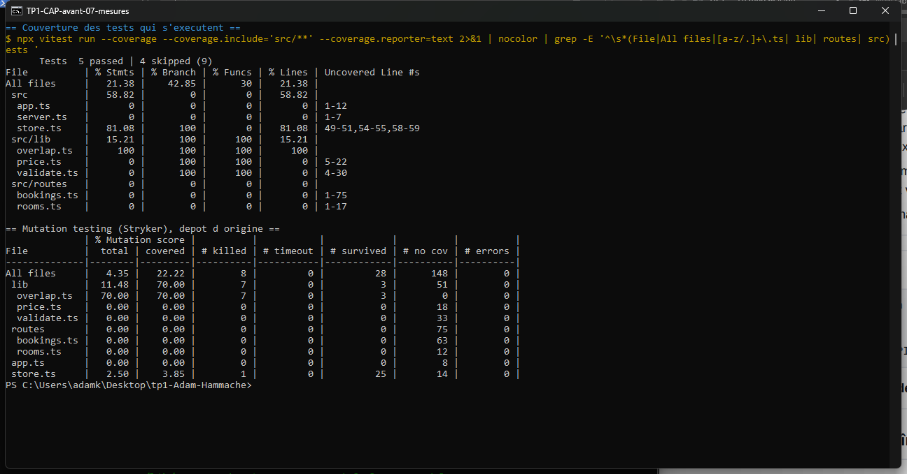
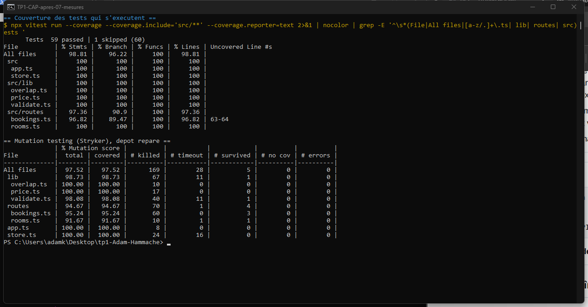

**Bugs attrapés par le filet une fois réparé**, tous reproduits sur l'API lancée :

| Bug | Preuve | Cause | Correction |
|---|---|---|---|
| Une réservation de week-end coûte `"5020"` au lieu de `70` (chaîne, pas nombre). | `curl` ; test `price` ; `tsc` strict sans `@ts-nocheck` | `WEEKEND_SURCHARGE = "20"` | `20` |
| Deux réservations bout à bout sont refusées (409), alors que la doc dit `[debut, fin[`. | `curl` ; test `bookings` | `<=` dans `overlaps` | `<` |
| `"Nov 2 2026"` est accepté comme date, contre la convention ISO 8601 UTC. *trouvé en sondant l'API, pas par un test existant* | `curl` → 201 | `requireDate` se contente de `Date.parse` | Format ISO UTC exigé, tests ajoutés. |

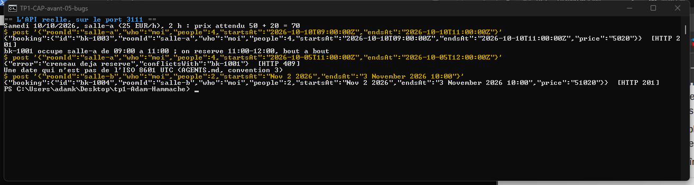
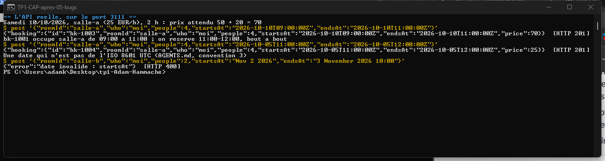

### CI et Git

| # | Symptôme | Cause | Réparation |
|---|---|---|---|
| 22 | La CI ne lance que le lint — celui qui n'a aucune règle. Les tests sont commentés (« ça bloquait les merges »), pas de typecheck. Une CI verte ne dit rien. *exécuté (lecture du workflow ; la CI GitHub elle-même n'a pas été déclenchée)* | `.github/workflows/ci.yml` | typecheck, lint, tests avec seuils de couverture. |
| 23 | `.env` est suivi par Git (URL de base, secret de session, clé de facturation) et absent de `.gitignore`. *exécuté* | `.env`, `.gitignore` | Retiré de l'index, `.env.example` à la place, `.gitignore` complété. |
| 24 | Sous Windows, les scripts shell sortent en CRLF. *exécuté* | pas de `.gitattributes` | `.gitattributes` : LF pour `*.sh` et `.husky/*`. |

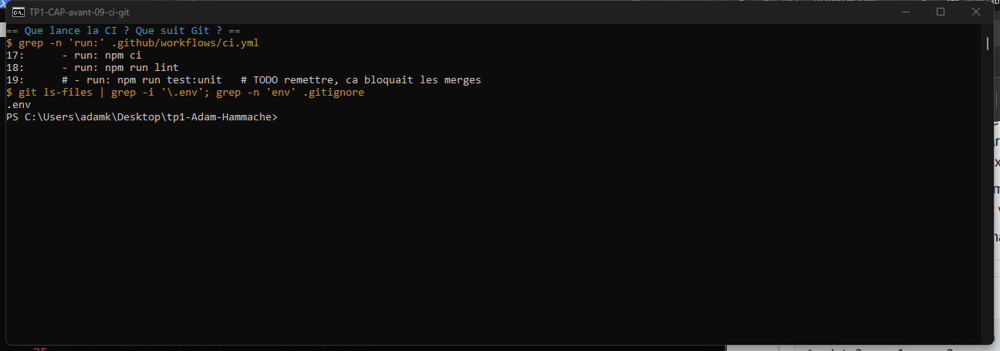
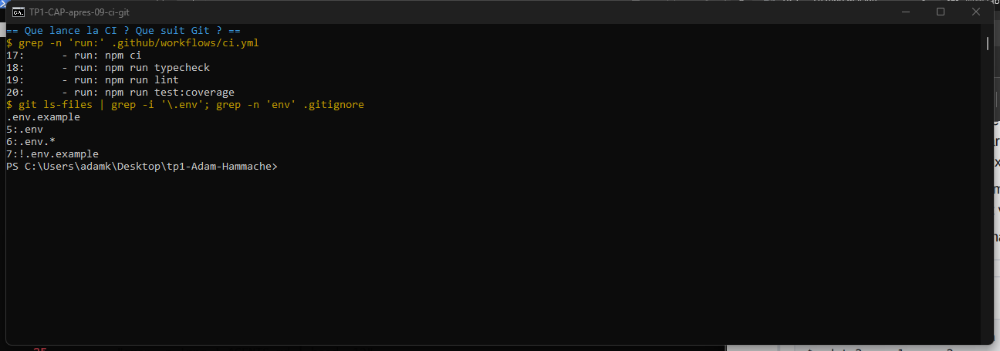

## Ce qui ressemble à un défaut et n'en est pas un

Laissés tels quels, parce que ce qui les entoure dit qu'ils sont voulus.

- **Le `it.skip` « SKIP ASSUMÉ »** de `overlap.spec.ts` : la fixture n'a jamais été versée
  (INFRA-198), le commentaire le dit et dit quand le réactiver.
- **Le motif `*.spec.ts`** de `vitest.config.ts` : c'est la convention (INFRA-205). Le
  défaut était les deux fichiers qui ne la suivaient pas.
- **« Pas de JSDoc » dans `src/lib/`** : une règle locale qui déroge explicitement à la
  règle générale. Gardée, et l'exception est maintenant citée dans le `AGENTS.md` racine.
- **« Ne pas toucher à `src/store.ts` »** : respecté, y compris pour le tester.
- **`planner` ne peut écrire que dans `.opencode/plans/*.md`, `tester` que dans
  `.opencode/scratch/`** (ignoré par Git) : des droits taillés pour le rôle.
- **`reviewer` n'a que `git diff/log/show/status`** : il juge un diff, c'est `tester` qui
  exécute.
- **`dev` : `ask` sur `git reset --hard`, `git clean`, `rm -rf`** : des garde-fous, pas
  des oublis.
- **`explorer` écrit ses notes sur disque** : c'est ce qui garde le contexte de
  l'orchestrateur propre. Gardé, mais borné au dossier des plans.
- **Le hook d'après écriture avertit sans interrompre** (INFRA-231) : défendable, puisque
  l'écriture a déjà eu lieu. Le défaut était que rien d'autre ne bloquait et que `/ship`
  s'appuyait dessus.
- **Stockage en mémoire, pas de base, pas de build** : annoncé et suffisant.

## Ce que je n'ai pas corrigé, et pourquoi

- **Le `.env` reste dans l'historique Git.** Le retirer demande de réécrire l'historique
  et de forcer un push sur un dépôt partagé. Les valeurs sont annoncées comme pédagogiques ;
  dans un vrai projet elles devraient être changées.
- **La convention `Result`** n'a pas été appliquée au code : j'ai aligné la règle sur le
  code plutôt que de réécrire la gestion d'erreurs d'un service en production. C'est le
  choix inverse qui se défendrait si l'équipe tenait à la refonte.
- **Un corps JSON malformé renvoie une page HTML avec la pile d'appels** (400 d'Express).
  Constaté par `curl`, hors périmètre.
- **Cinq mutants survivent** : trois sont équivalents (`""` au lieu de `"/"` dans un
  routeur), un est redondant (`typeof` avant `Number.isInteger`), un correspond à la
  relance d'une erreur non prévue dans `bookings.ts` (lignes 63-64), non testée.
- **Les modèles `opencode/deepseek-v4-*`** et le plugin `.opencode/plugin/checks.js`
  (nom du champ lu dans `input.args`) n'ont pas été vérifiés : il faudrait OpenCode.
- **La JSDoc des fonctions exportées** n'est pas vérifiée par le lint : il faudrait une
  dépendance de plus.

**Dépendances de développement ajoutées**, alors que `AGENTS.md` demande d'en parler
d'abord : `husky`, `@vitest/coverage-v8`, `@eslint/js`, `@stryker-mutator/core`,
`@stryker-mutator/vitest-runner`. Sans elles, ni hook, ni mesure. À valider.

## Exercice 1 — la même tâche, après

Session neuve sur un clone du dépôt réparé :
[transcription](preuves/ex1/apres.resume.txt), [diff produit](preuves/ex1/apres.diff).

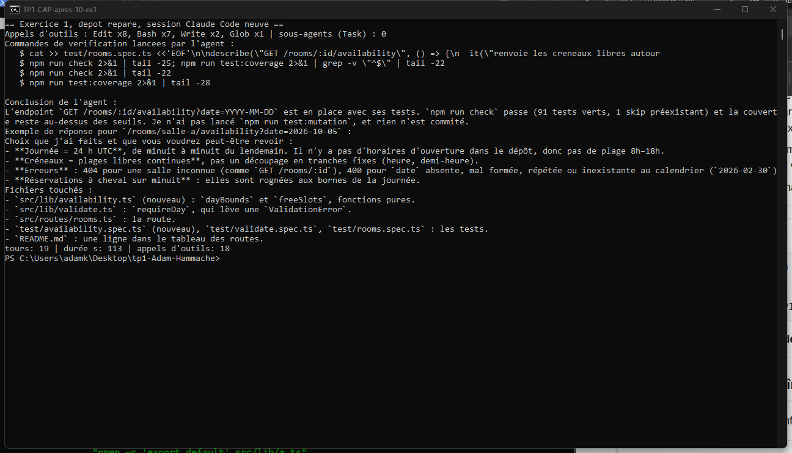

| | Avant | Après |
|---|---|---|
| Conventions suivies | la règle fausse de `src/lib/` (`export default`) | exports nommés, `ValidationError`, comme le reste du code |
| Checks lancés par l'agent | `test:unit`, `typecheck`, `lint` — verts sans rien vérifier | `npm run check` puis `test:coverage`, sous seuils |
| Tests exécutés à la fin | 23, dont 18 nouveaux ; 2 fichiers existants jamais lancés | 91, dont 32 nouveaux ; tous les fichiers |
| Bugs existants | prix `"5020"` non vu ; chevauchement vu et laissé | corrigés avant, l'endpoint est cohérent avec `POST /bookings` |
| Sous-agents | aucun | aucun |

Ce qui ne change pas : dans Claude Code, un seul agent fait tout. La répartition des rôles
réparée dans `.opencode/` ne se voit qu'en lançant OpenCode.

## Fichiers de preuve

- [`preuves/scripts/preuve.sh`](preuves/scripts/preuve.sh) — rejoue chaque preuve dans un clone : `bash preuves/scripts/preuve.sh <rules|tests|tests-tous|lint|hooks|checks|bugs|mcp|mcp-detail|couverture|droits|ci-git> <dossier>`
- [`preuves/mesure-mcp.mjs`](preuves/mesure-mcp.mjs) — interroge chaque serveur MCP et mesure ses définitions d'outils
- [`preuves/mesure-mcp-detail.mjs`](preuves/mesure-mcp-detail.mjs) — démarrage, outils qui écrivent, vrai appel sans jeton
- [`preuves/mutation-avant.txt`](preuves/mutation-avant.txt), [`preuves/mutation-apres.txt`](preuves/mutation-apres.txt) — rapports Stryker complets
- [`preuves/ex1/`](preuves/ex1/) — transcriptions et diffs des deux exécutions de l'exercice 1
- [`preuves/hook-claude-code.jsonl`](preuves/hook-claude-code.jsonl) — session où le hook renvoie le rouge à l'agent
